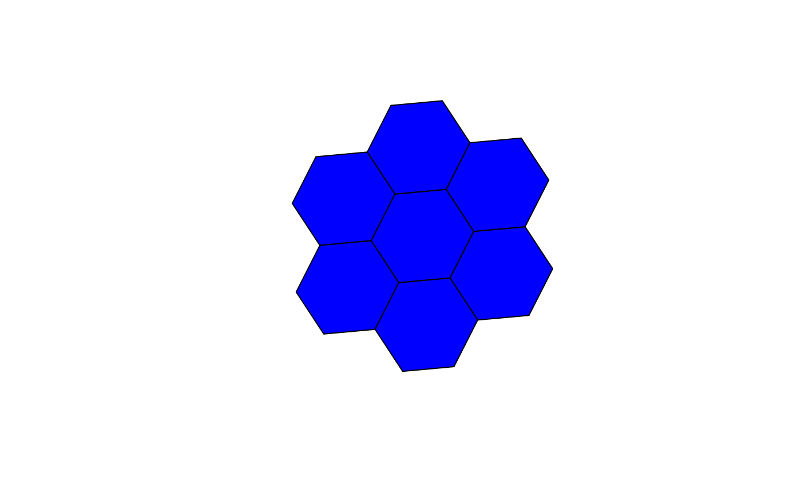
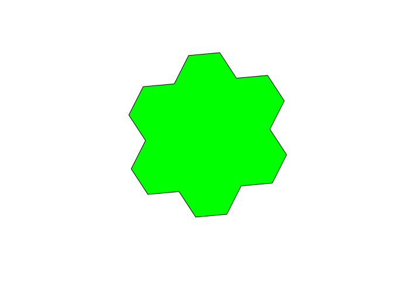

<!-- README.md is generated from README.Rmd. Please edit that file -->
H3-R
====

[](https://travis-ci.org/crazycapivara/h3-r) [](https://www.repostatus.org/#active) [](https://github.com/uber/h3/releases/tag/v3.3.0)

Provides R bindings for [H3](https://uber.github.io/h3/), a hexagonal hierarchical spatial indexing system.

Documentation
-------------

-   [H3-R](https://crazycapivara.github.io/h3-r/)
-   [H3](https://uber.github.io/h3/)

Notes
-----

Succesfully built on

-   Linux
-   OSX

If you cannot build the C library you might check [crazycapivara/h3forr](https://github.com/crazycapivara/h3forr) providing bindings via [V8](https://github.com/jeroen/V8) and [h3-js](https://github.com/uber/h3-js).

Requirements
------------

First of all you need to build the [H3 C library](https://github.com/uber/h3) from source. Therefore, you need a C compiler, `cmake` and `make`.

Then you can run:

``` bash
git clone https://github.com/crazycapivara/h3-r.git
pushd h3-r
chmod +x install-h3c.sh
# Install H3 C Library
./install-h3c.sh
# Install H3 for R
R -q -e 'devtools::install()'
popd
rm -rf h3-r
```

Installation
------------

You can install h3 from github with:

``` r
# install.packages("devtools")
devtools::install_github("crazycapivara/h3-r")
```

Usage
-----

Core functions:

``` r
library(h3)

coords <- c(37.3615593, -122.0553238)
resolution <- 7

# Convert a lat/lng point to a hexagon index at resolution 7
(h3_index <- geo_to_h3(coords, resolution)) 
#> [1] "87283472bffffff"

# Get the center of the hexagon
h3_to_geo_sf(h3_index)
#> Simple feature collection with 1 feature and 0 fields
#> geometry type:  POINT
#> dimension:      XY
#> bbox:           xmin: -122.0503 ymin: 37.35172 xmax: -122.0503 ymax: 37.35172
#> epsg (SRID):    4326
#> proj4string:    +proj=longlat +datum=WGS84 +no_defs
#>                     geometry
#> 1 POINT (-122.0503 37.35172)

# Get the vertices of the hexagon
h3_to_geo_boundary(h3_index)
#> [[1]]
#>           lat       lng
#> [1,] 37.34110 -122.0416
#> [2,] 37.35290 -122.0340
#> [3,] 37.36352 -122.0428
#> [4,] 37.36234 -122.0591
#> [5,] 37.35054 -122.0666
#> [6,] 37.33992 -122.0579

# Get the polygon of the hexagon
h3_to_geo_boundary_sf(h3_index)
#> Simple feature collection with 1 feature and 0 fields
#> geometry type:  POLYGON
#> dimension:      XY
#> bbox:           xmin: -122.0666 ymin: 37.33992 xmax: -122.034 ymax: 37.36352
#> epsg (SRID):    4326
#> proj4string:    +proj=longlat +datum=WGS84 +no_defs
#>                         geometry
#> 1 POLYGON ((-122.0416 37.3411...
```

Useful algorithms:

``` r
# Get all neighbors within 1 step of the hexagon
radius <- 1
(neighbors <- k_ring(h3_index, radius))
#> [1] "87283472bffffff" "87283472affffff" "87283470cffffff" "87283470dffffff"
#> [5] "872834776ffffff" "872834729ffffff" "872834728ffffff"

h3_to_geo_boundary_sf(neighbors) %>%
  sf::st_geometry() %>% plot(col = "blue")
```



``` r

h3_set_to_multi_polygon(neighbors) %>%
  sf::st_geometry() %>% plot(col = "green")
```



Run tests
---------

``` r
devtools::test()
#> Loading h3
#> Testing h3
#> H3 hierachy: ....
#> H3 indexing: .....
#> H3 misc: ..
#> H3 traversal: .....
#> 
#> DONE ======================================================================
```
